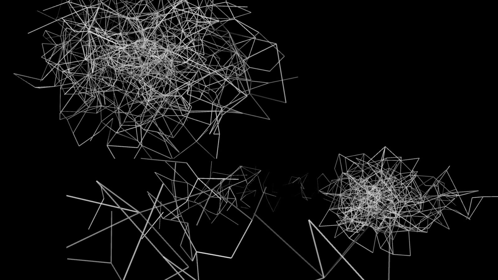

# Double Agent by MOD.

Can you teach an algorithm to dance?

Double Agent is an interactive dance piece built by Simon Biggs for an exhibit at MOD. from May - October 2018.

The exhibit is in two parts - a pre-trained Machine Learning algorithm that generates artificial human skeletons based on hundreds of hours of training watching professional dancers.

The second part is a live interactive display, using a Kinect 2 sensor to detect live skeletons of people dancing in front of it.

Read more: [mod.org.au/double-agent](https://mod.org.au/exhibits/double-agent/) 

Or visit [Double Agent at MOD.](https://mod.org.au/visit/getting-here/).

## Software

The software was written by Simon Biggs using the [Processing.org](https://processing.org) framework.

There are three Processing sketches to run Double Agent.

1. Kinect 2 UDP - sensor to detect live skeletons, and a UDP server to send the skeleton data to another computer to display the data.
2. DoubleAgent 1 - projection app showing the machine learning data.
3. DoubleAgent 2 - projection app showing the live data.

**TODO**: Add double agent projects as [sub-modules](https://blog.github.com/2016-02-01-working-with-submodules/)

There are also some third party libraries used that aren’t included in this repository, below are instructions to install them:

* **TODO**: include instructions.

## Credits

* Artist & Programmer: [Simon Biggs](http://littlepig.org.uk/)
* Machine Learning developer: Samya Bagchi
* Choreography: Sue Hawksley and Tammy Arjona

## License

Released under an [MIT License](LICENSE).

Copyright (c) 2018 [MOD.](https://mod.org.au)